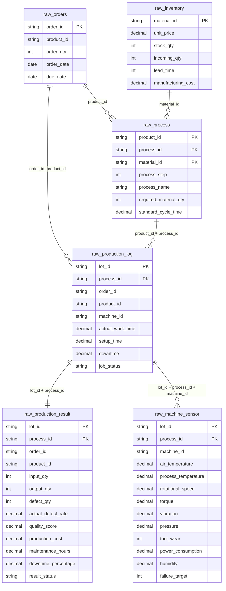

# 데이터 명세서 V1

```
본 문서는 생산관리 통합 분석 프로젝트의 데이터 명세서 v1으로,
외부 데이터셋을 기반으로 프로젝트에 적합한 원본 데이터를 생성하고
Raw 레이어에 적재하기 위한 설계를 정의합니다.

현재 단계(v1)에서는 전체 데이터 파이프라인 중
"원본 데이터 구축 및 Raw 레이어 적재"까지를 범위로 합니다.

이후의 단계에서는 Staging, Data Mart, 분석 모듈까지를 설계합니다.

본 단계에서는 다음 작업을 수행합니다.

1. 외부 데이터셋 분석 및 컬럼 구조 파악
2. 프로젝트용 원본 데이터 스키마 설계
3. 데이터 간 공통 키 생성 (product_id, order_id, lot_id)
4. 외부 데이터셋을 기반으로 프로젝트용 CSV 생성
5. Raw 레이어 테이블 설계 및 적재
```


---

## 1. 원본 데이터 구축

```
원본 데이터 구축의 목적은 서로 다른 구조를 가진 외부 데이터셋을
하나의 생산관리 흐름으로 통합 가능한 형태로 재구성하는 것입니다.

외부 데이터셋 간 직접적인 조인이 불가능하기 때문에,
공통 식별자(product_id, lot_id 등)를 따로 생성하여
데이터 간 연결이 가능하도록 설계합니다.

이를 통해 이후 Staging 및 Data Mart 단계에서 
일관된 데이터 모델을 기반으로 분석이 가능하도록 합니다.

또한 본 프로젝트는 생산관리 흐름을 기준으로 데이터 구조를 설계하며,
데이터는 다음 단위를 기준으로 연결됩니다.

- product_id: 제품 단위
- order_id: 주문 단위
- lot_id: 생산 단위 (공정 흐름 단위)
  
각 단위는 서로 다른 레벨의 데이터를 연결하기 위한 기준으로 사용됩니다.

데이터는 다음과 같은 흐름으로 연결됩니다.

Orders 생성
→ product_id 기준으로 Inventory와 연결
→ 주문 기준으로 Process 데이터 매핑
→ Process 기준으로 lot_id 생성
→ lot_id 기준으로 Production Result 데이터 결합
→ lot_id 및 machine_id 기준으로 Sensor 데이터 결합

본 프로젝트에서는 생산 공정을 A → B → C → D → E 순서로 진행되는
직렬 공정(Serial Process) 구조로 가정합니다.

- 각 공정은 이전 공정의 결과를 입력으로 받아 다음 공정으로 전달
- 하나의 lot_id는 하나의 생산 흐름을 의미
- 동일 lot_id 내에서 공정이 순차적으로 수행
- 공정 순서는 process_step 컬럼으로 관리 (A=1, B=2, C=3, D=4, E=5)
```


### 1.1 외부 데이터셋 (사용 데이터셋)

```
본 프로젝트에서는 원본 데이터 생성을 위한 외부 데이터셋으로 다음과 같은
공개 데이터셋과 생성 데이터셋을 사용합니다.

- Supply Chain Dataset
- Manufacturing Dataset
- Manufacturing Defect Dataset
- Predictive Maintenance Dataset
- Orders (생성 데이터)
```

- **Supply Chain Dataset**
	- 제품 단위의 재고, 수요, 리드타임 정보를 포함
	- Inventory(재고) 원본 데이터 생성에 활용
	- 사용 컬럼
		- `SKU`
		- `Product type`
		- `Price`
		- `Stock levels`
		- `Availability`
		- `Order quantities`
		- `Lead time`
		- `Production volumes`
		- `Manufacturing lead time`
		- `Manufacturing costs`
		- `Defect rates`
	- 활용 방식
		- `SKU` → `product_id`로 변환하여 공통 식별자로 사용
		- `Stock levels` → 현재 재고량(`stock_qty`)
		- `Order quantities` → 수요량(`demand_qty`)
		- `Lead time` → 납기 계산 기준
		- `Production volumes` → 생산 가능량
		- `Manufacturing lead time` → 생산 소요 시간
		- `Defect rates` → 기본 불량률

- **Manufacturing Dataset**
	- 공정, 설비, 작업 시간 정보를 포함
	- Process(공정) 원본 데이터 생성에 활용
	- 사용 컬럼
		- `Job_ID`
		- `Machine_ID`
		- `Operation_Type`
		- `Processing_Time`
		- `Scheduled_Start`
		- `Scheduled_End`
		- `Actual_Start`
		- `Actual_End`
		- `Job_Status`
	- 활용 방식
		- `Job_ID` → `lot_id`로 사용
		- `Machine_ID` → `machine_id`
		- `Operation_Type` → 공정 유형(`process_type`)
		- `Processing_Time` → 공정 소요 시간(`cycle_time`)
		- `Scheduled` / `Actual` 시간 → 공정 계획 및 실제 작업 시간

- **Manufacturing Defect Dataset**
	- 생산량, 품질, 불량률 정보를 포함
	- Quality(품질) 원본 데이터 생성에 활용
	- 사용 컬럼
		- `ProductionVolume`
		- `ProductionCost`
		- `DefectRate`
		- `QualityScore`
		- `MaintenanceHours`
		- `DowntimePercentage`
	- 활용 방식
		- `ProductionVolume` → 생산량(`input_qty`)
		- `DefectRate` → 불량률
		- `QualityScore` → 품질 지표
		- `MaintenanceHours` / `Downtime` → 공정 영향 변수

- **Predictive Maintenance Dataset**
	- 설비 센서 및 고장 데이터를 포함
	- 공정 변수 및 설비 상태 분석에 활용
	- 사용 컬럼
		- `Product ID`
		- `Type`
		- `Air temperature [K]`
		- `Process temperature [K]`
		- `Rotational speed [rpm]`
		- `Torque [Nm]`
		- `Tool wear [min]`
		- `Target`
	- 활용 방식
		- `Product ID` → 원본 센서 데이터의 장비/제품 식별자
		- 센서 값 → 공정 변수 (품질 영향 분석)
		- `Target` → 설비 이상 여부

- **Orders Dataset**
	- 주문 기반 생산 흐름을 구성하기 위한 생성 데이터
	- 사용 컬럼
		- `order_id`
		- `product_id`
		- `order_qty`
		- `order_date`
		- `due_date`
	- 생성 방식
		- `product_id`는 `Inventory` 기준으로 생성
		- `order_qty`는 수요 기반 생성
		- `due_date`는 `lead_time` 기반 계산


### 1.2 데이터 통합 전략

```
각 데이터셋은 서로 다른 구조를 가지며 공통 키가 존재하지 않기 때문에,
공통 식별자를 생성하여 데이터를 통합합니다.

공통 식별자는 다음과 같습니다.

- product_id
- order_id
- lot_id

또한 각 데이터셋 간 직접적인 연결 키가 없기 때문에
기본적으로 랜덤 매핑을 사용하되, 데이터 분포를 유지하도록 샘플링 기반 매핑을 수행합니다.
```

- **product_id 생성**
	- 완제품 단위 식별자로 별도 생성
	- Orders(주문) 및 Process(공정) 데이터에서 사용
	- 하나의 `product_id`는 여러 개의 `material_id`를 가질 수 있음

- **material_id 생성**
	- Supply Chain Dataset의 SKU를 기준으로 생성
	- Inventory(재고) 및 Process(공정)에서 사용

- **order_id 생성**
	- Orders(주문) 데이터 생성 시 부여
	- 생산 및 공정 데이터와 연결

- **lot_id 생성**
	- 공정 단위 식별자로 사용
	- 하나의 생산 사이클을 의미
	- `Process`, `Quality`, `Sensor` 데이터를 연결하는 기준


- **데이터 매핑 방식**	
	- Process(공정) 데이터		
			- 제품 기준(`product_id`)으로 공정 구조를 생성		
			- 각 `product_id`는 A → B → C → D 공정을 모두 가짐		
			- 각 공정 단계는 하나 이상의 `material_id`와 연결되어 제품별 공정 및 원자재(BOM) 구조를 구성함	
	- Production Log(공정 실행 이력)		
		- 주문 데이터(`Orders`) 기준으로 생성		
		- 하나의 `order_id`는 하나 이상의 `lot_id`로 분해되며, 각 `lot_id`는 A → B → C → D 공정을 순차적으로 수행	
	- Production Result(생산 결과) 데이터		
		- 공정 단위(`lot_id`, `process_id`) 기준으로 매핑		
		- 공정 실행 결과와 결합하여 실제 생산량, 불량률, 품질 데이터를 생성	
	- 센서 데이터		
		- 설비(`machine_id`) 및 `lot_id`, `process_id` 기준으로 매핑		
		- 공정 실행 중 측정된 설비 및 공정 변수로 활용


---

## 2. Raw 레이어

```
Raw 레이어는 프로젝트용 원본 데이터를 저장하는 계층입니다.

본 프로젝트의 Raw 레이어는 외부 데이터셋을 그대로 적재하는 계층이 아니라,
서로 다른 외부 데이터셋을 생산관리 흐름에 맞게 재구성한 
프로젝트용 원본 CSV를 적재하는 계층으로 정의합니다.

Raw 레이어의 목적은 다음과 같습니다.

- 프로젝트용 원본 데이터 보존
- 이후 Staging 레이어 정제 작업의 기준 데이터 제공
- 주문, 재고, 공정, 품질 데이터를 연결 가능한 형태로 저장
- 데이터 생성 및 매핑 결과의 재현성 확보

Raw 레이어에서는 KPI 계산, 결측치 보정, 이상치 제거, 분석용 집계는 수행하지 않습니다.
다만, 서로 다른 데이터셋 간 연결을 위해 필요한 공통 식별자
product_id, order_id, lot_id, process_id 등은 원본 데이터 생성 단계에 포함합니다.

또한 품질 데이터 관련 생산 변수의 파생 변수 생성 역시 원본 데이터 생성 단계에 포함합니다.
```

### 2.1 Raw 레이어 설계 원칙

```
Raw 레이어는 다음 원칙에 따라 설계합니다.

- 프로젝트용 원본 데이터 보존
- 공통 키 포함
- 비즈니스 로직 최소화
- 데이터 품질 판단 유보
- 테이블 역할 명확화
```

- **프로젝트용 원본 데이터 보존**
	- 외부 데이터셋을 기반으로 생성한 프로젝트용 CSV를 그대로 적재
	- Raw 적재 이후에는 원본 값을 임의로 수정하지 않음

- **공통 키 포함**
	- 데이터 간 연결을 위해 `product_id`, `order_id`, `lot_id`를 포함
	- 해당 키는 이후 Staging 및 Data Mart 단계에서 조인 기준으로 사용

- **비즈니스 로직 최소화**
	- 재고 부족 여부, 납기 지연 여부, 불량률 판단 등 분석 로직은 Raw 단계에서 수행하지 않음
	- Raw 레이어는 분석 결과가 아닌 원천 데이터 저장이 목적

- **데이터 품질 판단 유보**
	- 결측치, 이상치, 불일치 값은 Raw 단계에서 삭제하지 않음
	- 데이터 품질 검증 및 플래그 처리는 Staging 단계에서 수행

- **테이블 역할 명확화**
	- 주문, 재고, 공정, 품질/액션 데이터를 각각 별도 테이블로 분리


### 2.2 Raw 레이어 테이블 목록

```
본 프로젝트에서는 데이터의 역할에 따라 Raw 레이어의 테이블을 다음과 같이 분리합니다.

- 주문 데이터: 생산 흐름의 시작점
- 재고 데이터: 생산 가능 여부 판단 기준
- 공정 기준 데이터: 공정 순서 및 원자재 소요 기준
- 공정 실행 데이터: 주문/lot 기준 실제 공정 수행 이력
- 생산 결과 데이터: 공정별 실제 생산량 및 품질 결과
- 센서 데이터: 공정 원인 변수 (온도, 토크 등)
```

| 테이블명                    | 설명                                             | 주요 Source                                                   |
| :---------------------- | :--------------------------------------------- | :---------------------------------------------------------- |
| `raw_orders`            | 주문 기반 생산 흐름의 시작점이 되는 주문 데이터                    | 생성 데이터                                                      |
| `raw_inventory`         | 원자재 단위 재고, 단가, 입고 예정 수량, 조달 리드타임 데이터           | Supply Chain Dataset                                        |
| `raw_process`           | 제품별 공정 순서와 공정별 필요 원자재를 정의하는 공정 기준/BOM 데이터      | Manufacturing Dataset + Supply Chain Dataset + 생성 공정 기준     |
| `raw_production_log`    | 주문/lot 기준 공정 실행 이력 및 설비 배정, 실제 작업 시간 데이터       | Orders Dataset + raw_process + Manufacturing Dataset + 생성 키 |
| `raw_production_result` | 공정 실행 이후 실제 생산량, 불량 수량, 실제 불량률, 품질 점수 데이터      | Manufacturing Defect Dataset + raw_production_log           |
| `raw_machine_sensor`    | lot/process/machine 기준 공정 중 측정된 설비 및 공정 변수 데이터 | Predictive Maintenance Dataset + raw_production_log         |

### 2.3 Raw 테이블 간 관계

```
Raw 레이어의 테이블은 product_id, order_id, lot_id, machine_id를 기준으로 연결합니다.

본 프로젝트에서는 주문에서 시작해
재고, 공정, 품질, 센서 데이터로 이어지는 생산관리 흐름을 구성합니다.

각 데이터 간 연결은 다음과 같습니다.

- raw_inventory(재고)와 raw_process(공정 기준)는 product_id를 기준으로 연결
	- 주문된 제품이 어떤 공정을 거치는지 정의

- raw_inventory(재고)와 raw_process(공정 기준)는 material_id를 기준으로 연결
	- 각 공정 단계에서 필요한 원자재를 재고와 연결

- raw_orders(주문)와 raw_production_log(공정 실행 이력)는 
  order_id, product_id를 기준으로 연결
	- 하나의 주문은 하나 이상의 lot으로 분해 가능

- raw_process(공정 기준)와 raw_production_log(공정 실행 이력)는 
  product_id, process_id를 기준으로 연결
	- 각 제품(product_id)이 A → B → C → D 공정을 순서대로 수행

- raw_production_log(공정 실행 이력)와 raw_production_result(생산 결과)는 
  lot_id, process_id를 기준으로 연결
	- 각 공정 실행 이후 실제 생산량, 불량 수량, 실제 불량률, 품질 점수를 연결

- raw_production_log(공정 실행 이력)와 raw_machine_sensor(센서)는 
  lot_id, process_id, machine_id를 기준으로 연결
	- 각 공정 실행 중 측정된 설비/공정 변수를 연결
```




### 2.4 테이블 상세 명세


#### raw_orders

```
테이블명: raw.raw_orders

테이블 Source: 생성 데이터

그레인(1행 정의): 1 row = 1개의 주문

Primary Key: order_id

Indexes:
	- idx_raw_orders_product_id (product_id)
	- idx_raw_orders_order_date (order_date)
	- idx_raw_orders_due_date (due_date)

설계 목적:
	- 주문 기반 생산관리 흐름의 시작점이 되는 주문 데이터를 저장
	- 제품별 주문 수량과 납기 정보를 기반으로 이후 재고 확인, 생산 계획, 공정 매핑의 
	  기준 데이터로 활용
	- Process 테이블 및 이후 생산 실행 이력(raw_production_log)과 연결 가능한
	  product_id, order_id 기준을 제공

적재 규칙:
	- order_id는 주문 단위 고유 식별자로 NOT NULL을 보장
	- product_id는 생성된 완제품 ID 기준으로 부여
	- product_id는 raw_process.product_id와 연결되어
	  해당 제품의 공정/BOM 구조를 식별하는 기준으로 사용
	- order_qty는 수요량(demand_qty) 또는 주문 수량 분포를 참고하여 생성
	- order_date는 프로젝트 분석 기간 내에서 생성
	- due_date는 order_date를 기준으로 기본 리드타임과 긴급도를 반영하여 생성
	- Raw 단계에서는 납기 지연 여부, 재고 부족 여부 등 판단 컬럼은 생성하지 않음
```

| 컬럼명          | 타입          | NULL | Key | 설명        | 생성 규칙/로직                       |
| :----------- | ----------- | ---- | --- | --------- | ------------------------------ |
| `order_id`   | VARCHAR(50) | N    | PK  | 주문 고유 식별자 | 생성 데이터에서 부여                    |
| `product_id` | VARCHAR(50) | N    | FK  | 주문 제품 식별자 | 생성된 완제품 ID                     |
| `order_qty`  | INT         | N    |     | 주문 수량     | 제품별 수요량 또는 주문 수량 분포 기반 생성      |
| `order_date` | DATE        | N    |     | 주문 일자     | 프로젝트 분석 기간 내 랜덤 또는 시계열 기준 생성   |
| `due_date`   | DATE        | N    |     | 납기일       | `order_date + lead_time` 기준 생성 |


#### raw_inventory

```
테이블명: raw.raw_inventory

테이블 Source: Supply Chain Dataset

그레인(1행 정의): 1 row = 1개의 원자재 재고 정보

Primary Key: material_id

설계 목적:
	- 공정별 생산에 필요한 원자재 재고 정보를 저장
	- 주문 수량과 공정별 원자재 필요량을 기준으로 생산 가능 여부를 판단하기 위한
	  기준 데이터 제공
	- 이후 Staging 단계에서 원자재 부족 여부, 발주 필요 여부, 리드타임 분석에 활용

적재 규칙:
	- material_id는 Supply Chain Dataset의 SKU를 기준으로 생성
	- 본 프로젝트에서는 하나의 공정이 하나의 원자재를 사용한다고 가정
	- Raw 단계에서는 원자재 부족 여부나 발주 필요 여부를 계산하지 않음
```

| 컬럼명                  | 타입            | NULL | Key | 설명             | 생성 규칙/로직              |
| :------------------- | ------------- | ---- | --- | -------------- | --------------------- |
| `material_id`        | VARCHAR(50)   | N    | PK  | 원자재 식별자        | `SKU` 기반 생성           |
| `unit_price`         | DECIMAL(10,2) | Y    |     | 원자재 단가         | `Price`               |
| `stock_qty`          | INT           | Y    |     | 현재 원자재 재고량     | `Stock levels`        |
| `incoming_qty`       | INT           | Y    |     | 입고 예정 또는 발주 수량 | `Order quantities`    |
| `lead_time`          | INT           | Y    |     | 원자재 조달 리드타임    | `Lead time`           |
| `manufacturing_cost` | DECIMAL(10,2) | Y    |     | 원자재/생산 관련 비용   | `Manufacturing costs` |


#### raw_process

```
테이블명: raw.raw_process

테이블 Source:
	- Manufacturing Dataset
	- Supply Chain Dataset
	- 생성 공정 기준 정보

그레인(1행 정의): 1 row = 1개의 공정 단계에서 사용하는 1개의 원자재 정보

Primary Key: (product_id, process_id, material_id)

Indexes:
	- idx_raw_process_process_step (process_step)
	- idx_raw_process_material_id (material_id)

설계 목적:
	- A → B → C → D → E 순서로 진행되는 공정 기준 정보를 저장
	- 각 공정 단계의 순서, 필요 원자재, 표준 소요 시간을 정의
	- 이후 생산 실행 이력(raw_production_log), 원자재 소요량 계산, 공정 스케줄링의
	  기준 테이블로 활용

적재 규칙:
	- process_id는 A, B, C, D, E 중 하나로 생성
	- process_step은 A = 1, B = 2, C = 3, D = 4, E = 5로 생성
	- 제품(product_id) 기준 공정별 원자재 구성 정보를 표현하는
	  단순화된 BOM 역할을 수행
	- 동일한 process_id, material_id 조합이라도 product_id에 따라 다른 row로 존재 가능
	- material_id는 raw_inventory.material_id 기준으로 매핑
	- required_material_qty는 공정 1회 수행에 필요한 원자재 수량을 의미
	- standard_cycle_time은 Manufacturing Dataset의 Processing_Time을 기반으로
	  산출 또는 샘플링하여 생성
	- standard_cycle_time은 공정 단위 기준값이며, 
	  동일 process_id 내에서는 동일한 값을 사용
	- Raw 단계에서는 병목 여부, 공정 지연 여부, 원자재 부족 여부를 계산하지 않음
```

| 컬럼명                     | 타입            | NULL | Key   | 설명                   | 생성 규칙/로직                     |
| :---------------------- | ------------- | ---- | ----- | -------------------- | ---------------------------- |
| `product_id`            | VARCHAR(50)   | N    | PK    | 제품 식별자               | 생성된 완제품 ID                   |
| `process_id`            | VARCHAR(50)   | N    | PK    | 공정 식별자               | A/B/C/D                      |
| `material_id`           | VARCHAR(50)   | N    | PK/FK | 공정 투입 원자재            | raw_inventory.material_id    |
| `process_step`          | INT           | N    |       | 공정 순서                | A=1, B=2, C=3, D=4           |
| `process_name`          | VARCHAR(50)   | Y    |       | 공정명                  | ex. Cutting / Assembly / ... |
| `required_material_qty` | INT           | N    |       | 공정 1회 수행에 필요한 원자재 수량 | 생성값                          |
| `standard_cycle_time`   | DECIMAL(10,2) | Y    |       | 표준 공정 소요 시간          | `Processing_Time` 기반         |


#### raw_production_log

```
테이블명: raw.raw_production_log

테이블 Source:
	- Orders Dataset
	- Process Dataset
	- Manufacturing Dataset
	- 생성키 (lot_id, machine_id)

그레인(1행 정의): 1 row = 1개의 lot에서 수행되는 1개의 공정 실행 이력

Primary Key: (lot_id, process_id) 복합 PK

Indexes:
	- idx_raw_prod_log_order_id (order_id)
	- idx_raw_prod_log_product_id (product_id)
	- idx_raw_prod_log_process_id (process_id)
	- idx_raw_prod_log_machine_id (machine_id)

설계 목적:
	- 주문별 생산 lot의 공정 실행 이력을 저장
	- A → B → C → D → E 공정 흐름을 실제 실행 기준으로 표현
	- 각 공정에 배정된 설비(machine_id)를 기록
	- 공정별 실제 작업 시간 데이터를 저장하여 이후 스케줄링 및 병목 분석의 입력 데이터로 활용
	  
적재 규칙:
	- 하나의 lot_id는 하나의 생산 흐름을 의미
	- 하나의 lot_id는 A, B, C, D, E 총 5개의 공정 실행 row를 가짐
	- process_id는 raw_process.process_id 기준
	- raw_production_log의 Primary Key는 (lot_id, process_id) 복합키로 정의
	- 동일 lot 내에서는 A → B → C → D → E 순서로 공정이 진행
	- 서로 다른 lot은 동일 공정에서 병렬 처리 가능
	- machine_id는 공정 단계별로 랜덤 또는 규칙 기반 매핑
	- actual_work_time은 Manufacturing Dataset의 Processing_Time을 기반으로 
	  생성 또는 샘플링
	- Raw 단계에서는 스케줄링 결과, 납기 지연 여부, 병목 여부를 계산하지 않음
```

| 컬럼명                | 타입            | NULL | Key   | 설명            | 생성 규칙/로직                       |
| :----------------- | ------------- | ---- | ----- | ------------- | ------------------------------ |
| `lot_id`           | VARCHAR(50)   | N    | PK    | 생산 흐름 식별자     | 주문 기준 생성                       |
| `process_id`       | VARCHAR(50)   | N    | PK/FK | 공정 식별자        | `raw_process.process_id`       |
| `order_id`         | VARCHAR(50)   | N    | FK    | 주문 식별자        | `raw_orders.order_id`          |
| `product_id`       | VARCHAR(50)   | N    | FK    | 제품 식별자        | `raw_orders.product_id`        |
| `machine_id`       | VARCHAR(50)   | N    | FK    | 설비 식별자        | 공정별 설비 pool에서 매핑               |
| `actual_work_time` | DECIMAL(10,2) | Y    |       | 실제 공정 수행 시간   | `Process_Time` 기반 생성           |
| `setup_time`       | DECIMAL(10,2) | Y    |       | 공정 준비 시간      | 생성값 또는 일부 샘플링                  |
| `downtime`         | DECIMAL(10,2) | Y    |       | 공정 중 설비 중단 시간 | 생성값 또는 일부 샘플링                  |
| `job_status`       | VARCHAR(30)   | Y    |       | 작업 상태         | Completed / Delayed / Wating 등 |


#### raw_production_result

```
테이블명: raw.raw_production_result  
  
테이블 Source:  
	- Manufacturing Defect Dataset  
	- raw_production_log  
	- 생성 데이터  
  
그레인(1행 정의): 1 row = 1개의 lot에서 수행된 1개의 공정 결과  
  
Primary Key: (lot_id, process_id) 복합 PK  
  
Indexes:  
	- idx_raw_prod_result_order_id (order_id)  
	- idx_raw_prod_result_product_id (product_id)  
	- idx_raw_prod_result_process_id (process_id)  
	- idx_raw_prod_result_result_status (result_status)  
  
설계 목적:  
	- 공정 실행 이후의 실제 생산 결과와 품질 결과를 저장  
	- 각 lot/process 단위의 생산량, 불량 수량, 실제 불량률, 품질 점수를 기록  
	- 이후 머신러닝 기반 예측 불량률과 비교할 실제 관측값으로 활용  
	- 품질 분석, 불량률 비교, 공정별 품질 패턴 분석의 기준 데이터로 활용  
  
적재 규칙:  
	- raw_production_result는 raw_production_log 기준으로 생성  
	- 하나의 lot_id는 A, B, C, D 총 4개의 공정 결과 row를 가짐  
	- lot_id, process_id는 raw_production_log의 lot_id, process_id와 동일하게 매핑  
	- order_id, product_id는 raw_production_log에서 가져옴  
	- input_qty는 주문 수량 또는 공정 투입 수량을 기준으로 생성  
		- actual_defect_rate는 Manufacturing Defect Dataset의 DefectRate를 기반으로 샘플링  
	- defect_qty는 input_qty * actual_defect_rate 기준으로 생성  
	- output_qty는 input_qty - defect_qty 기준으로 생성  
	- quality_score는 Manufacturing Defect Dataset의 
	  QualityScore를 기반으로 생성  
	- production_cost, maintenance_hours, downtime_percentage는 
	  Manufacturing Defect Dataset 값을 기반으로 생성  
	- result_status는 actual_defect_rate 기준으로 
	  Normal / Warning /Fail 중 하나로 생성
	- Raw 단계에서는 예측 불량률, 불량 원인 판단, 품질 등급 분류는 수행하지 않음
```

| 컬럼명                   | 타입            | NULL | Key   | 설명        | 생성 규칙/로직                         |
| :-------------------- | :------------ | :--- | :---- | :-------- | :------------------------------- |
| `lot_id`              | VARCHAR(50)   | N    | PK/FK | 생산 흐름 식별자 | `raw_production_log.lot_id`      |
| `process_id`          | VARCHAR(50)   | N    | PK/FK | 공정 식별자    | `raw_production_log.process_id`  |
| `order_id`            | VARCHAR(50)   | N    | FK    | 주문 식별자    | `raw_production_log.order_id`    |
| `product_id`          | VARCHAR(50)   | N    | FK    | 제품 식별자    | `raw_production_log.product_id`  |
| `input_qty`           | INT           | Y    |       | 공정 투입 수량  | 주문 수량 또는 생산 수량 기반                |
| `output_qty`          | INT           | Y    |       | 정상 산출 수량  | `input_qty - defect_qty`         |
| `defect_qty`          | INT           | Y    |       | 불량 수량     | `input_qty * actual_defect_rate` |
| `actual_defect_rate`  | DECIMAL(10,4) | Y    |       | 실제 불량률    | `DefectRate` 기반                  |
| `quality_score`       | DECIMAL(10,2) | Y    |       | 품질 점수     | `QualityScore`                   |
| `production_cost`     | DECIMAL(10,2) | Y    |       | 생산 비용     | `ProductionCost`                 |
| `maintenance_hours`   | DECIMAL(10,2) | Y    |       | 유지보수 시간   | `MaintenanceHours`               |
| `downtime_percentage` | DECIMAL(10,2) | Y    |       | 설비 중단 비율  | `DowntimePercentage`             |
| `result_status`       | VARCHAR(30)   | Y    |       | 생산 결과 상태  | Normal / Warning / Fail          |


#### raw_machine_sensor

```
테이블명: raw.raw_machine_sensor

테이블 Source:
	- Predictive Maintenance Dataset
	- 생성 데이터

그레인(1행 정의): 1 row = 1개의 lot에서 수행되는 1개의 공정 실행 중 측정된 센서 데이터

Primary Key: (lot_id, process_id) 복합 PK

Indexes:
	- idx_raw_sensor_machine_id (machine_id)
	- idx_raw_sensor_process_id (process_id)
	- idx_raw_sensor_lot_id (lot_id)
	  
설계 목적:
	- 공정 실행 중 설비 상태 및 공정 변수 데이터를 저장
	- 공정별 센서 데이터 분포 차이를 반영하여 현실적인 생산 데이터 구성
	- 불량 원인 분석 및 머신러닝 모델 입력 데이터로 활용
	- 공정(process_id) 단위로 센서 특성을 구분하여 분석 가능하도록 설계

적재 규칙:
	- raw_machine_sensor는 raw_production_log 기준으로 생성
	- 하나의 lot_id는 A, B, C, D, E 총 5개의 센서 row를 가짐
	- process_id는 raw_process.process_id 기준
	- machine_id는 raw_production_log.machine_id와 동일하게 매핑
	- 센서 데이터는 Predictive Maintenance Dataset을 기반으로 샘플링하여 생성
	- base_value + noise 방식으로 생성하여 현실적인 데이터 분포를 유지
	- Raw 단계에서는 센서 이상 여부 판단, 불량 예측은 수행하지 않음
```

| 컬럼명                   | 타입            | NULL | Key   | 설명        | 생성 규칙/로직                        |
| :-------------------- | ------------- | ---- | ----- | --------- | ------------------------------- |
| `lot_id`              | VARCHAR(50)   | N    | PK    | 생산 흐름 식별자 | `raw_production_log.lot_id`     |
| `process_id`          | VARCHAR(50)   | N    | PK/FK | 공정 식별자    | `raw_process.process_id`        |
| `machine_id`          | VARCHAR(50)   | N    | FK    | 설비 식별자    | `raw_production_log.machine_id` |
| `air_temperature`     | DECIMAL(10,2) | Y    |       | 공기 온도     | `Air temperature[K]`            |
| `process_temperature` | DECIMAL(10,2) | Y    |       | 공정 온도     | 공정별 분포                          |
| `coolant_temperature` | DECIMAL(10,2) | Y    |       | 냉각수 온도    | 생성값                             |
| `motor_temperature`   | DECIMAL(10,2) | Y    |       | 모터 온도     | 생성값                             |
| `rotational_speed`    | DECIMAL(10,2) | Y    |       | 회전 속도     | 공정별 분포                          |
| `torque`              | DECIMAL(10,2) | Y    |       | 토크        | 공정별 분포                          |
| `vibration`           | DECIMAL(10,2) | Y    |       | 진동        | 생성값                             |
| `pressure`            | DECIMAL(10,2) | Y    |       | 압력        | 생성값                             |
| `load`                | DECIMAL(10,2) | Y    |       | 부하        | 생성값                             |
| `tool_wear`           | INT           | Y    |       | 공구 마모     | `Tool wear`                     |
| `tool_temperature`    | DECIMAL(10,2) | Y    |       | 공구 온도     | 생성값                             |
| `tool_vibration`      | DECIMAL(10,2) | Y    |       | 공구 진동     | 생성값                             |
| `machine_age`         | INT           | Y    |       | 설비 사용 기간  | 생성값                             |
| `maintenance_cycle`   | INT           | Y    |       | 유지보수 주기   | 생성값                             |
| `humidity`            | DECIMAL(10,2) | Y    |       | 습도        | 생성값                             |
| `power_consumption`   | DECIMAL(10,2) | Y    |       | 전력 소비량    | 생성값                             |
| `voltage`             | DECIMAL(10,2) | Y    |       | 전압        | 생성값                             |
| `failure_target`      | INT           | Y    |       | 설비 이상 여부  | `Target`                        |
