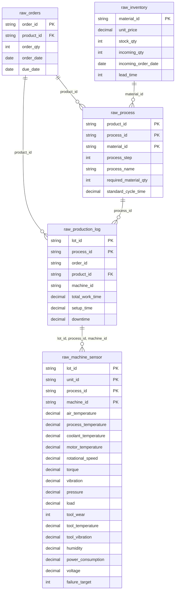

# 데이터 명세서 v2

```
본 문서는 생상관리 통합 분석 프로젝트의 데이터 명세서로,
주문 → 재고 → 공정 → 생산 → 설비 데이터까지 이어지는
생산관리 흐름을 기준으로 프로젝트용 원본 데이터를 설계하기 위한 문서입니다.

본 프로젝트는 생산관리 흐름을 기준으로
미래 주문 데이터, 현재 재고/공정 데이터,
과거 생산 및 설비 데이터를 통합하여
생산관리 데이터 파이프라인을 구축하는 것을 목표로 합니다.

본 문서에서는 프로젝트에서 사용할 원본 데이터 구조와
테이블 간 관계, 데이터 생성 규칙,
Raw 레이어 적재 기준을 정의합니다.

또한 이후 단계에서 수행할 Staging, Data Mart, 머신러닝 분석, 공정 스케줄링 분석의
기준 데이터 구조를 제공합니다.

본 단계에서는 다음 작업을 수행합니다.

1. 프로젝트용 원본 데이터 구조 설계
2. 데이터 간 공통 식별자 정의
3. 원본 데이터 생성 규칙 정의
4. Raw 레이어 테이블 설계
5. Raw 레이어 적재 기준 정의
6. 데이터 정합성(QC) 검증 기준 정의
```


---

## 1. 원본 데이터 구축

```
원본 데이터 구축의 목적은 서로 다른 외부 데이터셋과 생성 데이터를
하나의 생산관리 흐름으로 통합 가능한 형태로 재구성하는 것입니다.

본 프로젝트는 실제 생산관리 시스템을 단순화한
시뮬레이션 기반 생산관리 데이터 파이프라인 프로젝트이며,
주문 → 재고 → 공정 → 생산 → 설비 흐름을 기준으로 데이터를 설계합니다.

각 데이터셋은 서로 직접 연결 가능한 공통 키가 존재하지 않기 때문에,
프로젝트용 공통 식별자를 생성하여
데이터 간 연결이 가능하도록 구성합니다.

또한 생산관리 흐름을 명확히 표현하기 위해
데이터를 시점 기준으로 분리하여 설계합니다.

각 데이터별 시점은 다음과 같습니다.

- 미래 시점:
	- 앞으로 처리해야 할 주문 데이터
	- raw_orders

- 현재 시점:
	- 현재 보유 중인 재고 및 공정 기준 데이터
	- raw_inventory
	- raw_process

- 과거 시점:
	- 과거 생산 이력 및 설비 센서 데이터
	- raw_production_log
	- raw_machine_sensor

이를 통해 미래 주문을 현재 재고 및 공정 기준으로 처리하고,
과거 생산 데이터를 기반으로
공정 분석 및 설비 이상 분석이 가능하도록 설계합니다.

본 프로젝트에서는 생산 공정을
A → B → C → D → E 순서로 진행되는
직렬 공정 구조로 가정합니다.

공정 구조는 다음과 같습니다.

- 각 공정은 이전 공정의 결과를 입력으로 받아 다음 공정으로 전달
- 하나의 lot_id는 하나의 생산 흐름을 의미
- 동일 lot 내에서 공정은 순차적으로 수행
- 공정 순서는 process_step 컬럼으로 관리
	- A = 1
	- B = 2
	- C = 3
	- D = 4
	- E = 5
```

---
### 1.1 외부 데이터셋 및 생성 데이터

```
본 프로젝트에서는 공개 데이터셋과 생성 데이터를 함께 사용합니다.

외부 데이터셋은 실제 생산 및 공급망 환경의 데이터 분포를 반영하기 위한
기준 데이터로  활용하며, 프로젝트 목적에 맞게 재구성하여 사용합니다.

또한 공개 데이터셋만으로는
생산관리 흐름 전체를 구성하기 어렵기 때문에,
주문 데이터 및 생산 흐름 관련 일부 데이터는
프로젝트 목적에 맞게 생성 데이터 형태로 구성합니다.

본 프로젝트에서는 다음과 같은 데이터셋을 사용합니다.

- Supply Chain Dataset
- Manufacturing Dataset
- Predictive Maintenance Dataset
- 생성 데이터 (Orders 및 생산 흐름 데이터)
```

#### Supply Chain Dataset

```
재고, 단가, 리드타임 관련 정보를 포함하는 데이터셋입니다.

본 프로젝트에서는 원자재 재고 및 공급망 정보를 구성하기 위한 기준 데이터로 활용합니다.
```

- **활용 테이블**
	- `raw_inventory`

- **주요 활용 컬럼**
	- `SKU`
	- `Price`
	- `Stock levels`
	- `Order quantities`
	- `Lead time`

- **활용 목적**
	- `material_id` 생성 기준
	- 원자재 단가 생성
	- 현재 재고 수량 생성
	- 현재 재고 수량 생성
	- 입고 예정 수량 생성
	- 리드타임 생성

- **출처**
	- https://www.kaggle.com/datasets/amirmotefaker/supply-chain-dataset

#### Manufacturing Production Data

```
공정 유형, 작업 시간, 생산 작업 정보를 포함하는 데이터셋입니다.

본 프로젝트에서는 공정 기준 정보 및
과거 생산 이력 데이터를 생성하기 위한 기준 데이터로 활용합니다.
```

- **활용 테이블**
	- `raw_process`
	- `raw_production_log`

- **주요 활용 컬럼**
	- `Machine_ID`
	- `Operation_Type`
	- `Processing_Time`
	- `Job_Status`

- **활용 목적**
	- 공정 유형 생성
	- 공정별 표준 작업 시간 생성
	- 설비 pool 생성
	- 실제 작업 시간 분포 생성

- **출처**
	- https://www.kaggle.com/datasets/ziya07/manufacturing-production-data

#### Predictive Maintenance Dataset

```
설비 센서 데이터 및 설비 이상 여부(Target)를 포함하는 데이터셋입니다.

본 프로젝트에서는 설비 센서 데이터 생성 및
설비 이상 패턴 분석을 위한 기준 데이터로 활용합니다.
```

- **활용 테이블**
	- `raw_machine_sensor`

- **주요 활용 컬럼**
	- `Air temperature [K]`
	- `Process temperature [K]`
	- `Rotational speed [rpm]`
	- `Torque [Nm]`
	- `Tool wear [min]`
	- `Target`

- **활용 목적**
	- 설비 센서값 생성
	- 공정별 센서 분포 생성
	- 설비 이상 여부(`failure_target`) 생성 기준
	- 설비 이상 패턴 분석 기준

- **출처**
	- https://www.kaggle.com/datasets/stephanmatzka/predictive-maintenance-dataset-ai4i-2020

#### 생성 데이터

```
공개 데이터셋만을는 주문 기반 생산 흐름 전체를 구성하기 어렵기 때문에,
일부 데이터는 프로젝트 목적에 맞게 생성합니다.
```

- **생성 테이블**
	- `raw_orders`
	- `raw_production_log` 일부 컬럼
	- `raw_machine_sensor` 일부 컬럼

- **생성 목적**
	- 미래 주문 시뮬레이션
	- 생산 흐름 구성
	- 공통 식별자 생성
	- 생산관리 흐름 연결

---
### 1.2 데이터 통합 전략

```
각 데이터셋은 서로 다른 구조를 가지며,
직접적으로 연결 가능한 공통 키가 존재하지 않습니다.

따라서 본 프로젝트에서는
생산관리 흐름 기준의 공통 식별자를 생성하여
데이터 간 연결이 가능하도록 설계합니다.

데이터는 다음과 같은 생산 흐름을 기준으로 연결됩니다.

주문 생성
→ 재고 확인
→ 공정/BOM 확인
→ 생산 lot 생성 및 스케줄링
→ 공정 실행
→ 설비 센서 데이터 생성
→ 불량률 확인 및 불량 이유 분석

또한 데이터의 역할과 시점을 명확히 구분하기 위해
미래 / 현재 / 과거 시점 기준으로 데이터를 분리하여 관리합니다.

전체 데이터에서 사용하는 공통 식별자들은 다음과 같습니다.

- product_id: 완제품 단위 식별자
- material_id: 원자재 단위 식별자
- order_id: 주문 단위 식별자
- lot_id: 생산 실행 단위 식별자
- unit_id: lot 내부 개별 완제품 식별자
- process_id: 공정 단계 식별자
- machine_id: 실제 생산에 사용되는 설비 식별자
```

- **`product_id`**
	- 사용 테이블:
		- `raw_orders`
		- `raw_process`
		- `raw_production_log`
	- 역할:
		- 주문 제품 식별
		- 제품별 공정 흐름 식별
		- 제품별 BOM 연결
	- 예시:
		- PROD0001

- **`material_id`**
	- 사용 테이블:
		- `raw_inventory`
		- `raw_process`
	- 역할:
		- 원자재 재고 식별
		- 공정별 원자재 연결
		- BOM 구성
	- 예시:
		- SKU01

- **`order_id`**
	- 사용 테이블:
		- `raw_orders`
		- `raw_production_log`
	- 역할:
		- 주문 기준 생산 흐름 연결
		- 주문별 생산 추적
	- 예시:
		- ORD0001

- **`lot_id`**
	- 사용 테이블:
		- `raw_production_log`
		- `raw_machine_sensor`
	- 역할:
		- 생산 흐름 식별
		- 공정 실행 단위 연결
		- 설비 센서 데이터 연결
	- 예시:
		- LOT00001

- **`unit_id`**
	- 사용 테이블:
		- `raw_machine_sensor`
	- 역할:
		- 개별 생산 단위 식별
		- unit 단위 센서 분석
		- 세부 불량 패턴 분석
	- 예시:
		- LOT00001_A_001

- **`process_id`**
	- 사용 테이블:
		- `raw_process`
		- `raw_production_log`
		- `raw_machine_sensor`
	- 역할:
		- 공정 흐름 정의
		- 공정별 작업시간 분석
		- 공정별 센서 분석
	- 공정 정의:
		- A: 1
		- B: 2
		- C: 3
		- D: 4
		- E: 5

- **`machine_id`**
	- 사용 테이블:
		- `raw_production_log`
		- `raw_machine_sensor`
	- 역할:
		- 실제 사용 설비 추적
		- 설비별 작업시간 분석
		- 설비별 센서 분석
		- 설비 이상 분석
	- 예시:
		- MILL_004


---

## 2. Raw 레이어

```
Raw 레이어는 프로젝트용 원본 데이터를 저장하는 계층입니다.

본 프로젝트의 Raw 레이어는 외부 데이터셋을 그대로 적재하는 계층이 아니라,
프로젝트 목적에 맞게 재구성한 원본 데이터를 저장하는 계층으로 정의합니다.

Raw 레이어의 목적은 다음과 같습니다.

- 프로젝트용 원본 데이터 보존
- 생산 흐름 기준 데이터 연결 유지
- 이후 Staging 및 Data Mart 단계의 기준 데이터 제공
- 데이터 생성 결과 재현성 확보
- 공정 및 설비 분석 기준 데이터 제공

Raw 레이어에서는 집계, KPI 계산, 불량 분석, 병목 분석 등의
비즈니스 로직은 수행하지 않습니다.

또한 데이터 품질 판단 역시 Raw 단계에서는 수행하지 않으며,
결측치 처리, 이상치 처리, 상태 판단, 파생 컬럼 생성은 이후 Staging 단계에서 수행합니다.

본 프로젝트의 Raw 레이어는 생산 흐름 기준으로 다음과 같은 역할을 가집니다.

- 미래 주문 저장
- 현재 재고 상태 저장
- 현재 공정 / BOM 기준 저장
- 과거 생산 실행 이력 저장
- 과거 설비 센서 데이터 저장

이를 통해 미래 주문을 현재 기준으로 생산 가능 여부 판단 후,
과거 생산 데이터를 기반으로 설비 및 공정 분석이 가능하도록 설계합니다.
```

---
### 2.1 Raw 레이어 설계 원칙

```
Raw 레이어는 생산관리 흐름 기준의 원본 데이터를
최대한 손실 없이 보존하는 것을 목표로 설계합니다.

또한 이후 Staging, Data Mart, 분석 단계에서 재사용 가능하도록 
일관된 구조와 공통 식별자를 유지합니다.

이를 위한 Raw 레이어의 설계 원칙은 다음과 같습니다.

- 프로젝트용 원본 데이터 보존
- 시점 기준 데이터 분리
- 공통 식별자 유지
- 생산 흐름 기준 설계
- 분석 로직 최소화
- 데이터 품질 판단 유보
- 테이블 역할 명확화
```

- **프로젝트용 원본 데이터 보존**
	- 외부 데이터셋과 생성 데이터를 기반으로 구성한 프로젝트용 원본 데이터를 그대로 저장
	- Raw 적재 이후에는 원본 값을 임의로 수정하지 않음

- **시점 기준 데이터 분리**
	- 생산 흐름의 시간 개념을 명확히 표현하기 위해 미래 / 현재 / 과거 기준으로 데이터를 분리 저장
		- 미래:
			- `raw_orders`
		- 현재:
			- `raw_inventory`
			- `raw_process`
		- 과거:
			- `raw_production_log`
			- `raw_machine_sensor`

- **공통 식별자 유지**
	- 데이터 간 연결을 위해 공통 식별자를 유지
		- `product_id`
		- `material_id`
		- `order_id`
		- `lot_id`
		- `unit_id`
		- `process_id`
		- `machine_id`
	- 해당 식별자들은 이후 Staging 및 Data Mart 단계의 주요 조인 키로 사용

- **생산 흐름 기준 설계**
	- 데이터는 생산관리 흐름을 기준으로 연결되도록 설계
	- 주문 → 재고 → 공정/BOM → 생산 실행 → 설비 데이터 흐름을 기준으로 각 관계를 구성

- **분석 로직 최소화**
	- Raw 레이어에서는 비즈니스 판단 및 분석 로직을 수행하지 않음

- **데이터 품질 판단 유보**
	- 결측치, 이상치, 비정상 데이터 여부는 Raw 단계에서 판단하지 않음
	- 데이터 품질 검증 및 보정은 이후 QC 및 Staging 단계에서 수행

- **테이블 역할 명확화**
	- 각 테이블은 생산 흐름 내 역할 기준으로 분리하여 독립된 테이블로 관리
		- 주문 데이터
		- 재고 데이터
		- 공정/BOM 데이터
		- 생산 실행 데이터
		- 설비 센서 데이터

---
### 2.2 Raw 레이어 테이블 목록

```
본 프로젝트에서는 생산 흐름 기준으로 Raw 레이어 테이블을 분리하여 관리합니다.

각 테이블은 생산관리 흐름 내 역할에 따라 구분되며,
공통 식별자를 기준으로 서로 연결됩니다.

Raw 레이어의 테이블은 다음과 같습니다.
```

| 테이블명                 | 설명            | 시점  | 주요 연결 키                                             |
| :------------------- | ------------- | --- | --------------------------------------------------- |
| `raw_orders`         | 주문 데이터        | 미래  | `product_id` / `order_id`                           |
| `raw_inventory`      | 원자재 재고 데이터    | 현재  | `material_id`                                       |
| `raw_process`        | 공정/BOM 기준 데이터 | 현재  | `product_id` / `process_id` / `material_id`         |
| `raw_production_log` | 공정 실행 이력 데이터  | 과거  | `lot_id` / `process_id` / `machine_id` / `order_id` |
| `raw_machine_sensor` | 설비 센서 데이터     | 과거  | `lot_id` / `unit_id` / `process_id` / `machine_id`  |

---
### 2.3 Raw 테이블 간 관계

```
Raw 레이어의 테이블은
생산관리 흐름 기준으로 서로 연결됩니다.

본 프로젝트에서는
주문 → 재고 → 공정 → 생산 → 설비 흐름을 기준으로
데이터 간 관계를 구성합니다.

각 테이블은 공통 식별자를 기준으로 연결되며,
이를 통해 이후 Staging 및 Data Mart 단계에서 생산 흐름 전체를 추적할 수 있도록 설계합니다.
```



---
### 2.4 테이블 상세 명세


#### raw_orders

```
테이블명: raw.raw_orders

테이블 Source: 생성 데이터

시점: 미래 데이터

그레인 (1행 정의): 1 row = 1개의 미래(처리해야 할) 주문

Primary Key: order_id

Indexes:
	- idx_raw_orders_product_id (product_id)
	- idx_raw_orders_order_date (order_date)
	- idx_raw_orders_due_date (due_date)

설계 목적:
	- 향후 2주 동안 접수되는 미래 주문 데이터를 저장
	- 주문된 제품, 주문 수량, 주문일, 납기일 정보를 기반으로 
	  이후 재고 확인, 생산 가능 여부 판단, 공정 스케줄링의 기준 데이터로 활용
	- product_id를 통해 raw_process와 연결하여 
	  주문 제품별 공정 흐름 및 필요 원자재를 확인할 수 있도록 설계

적재 규칙:
	- order_id는 주문 단위 고유 식별자로 생성
	- product_id는 raw_process.product_id와 연결 가능한 완제품 ID 기준으로 생성
	- order_qty는 주문 수량을 의미하며 양의 정수로 생성
	- order_date는 미래 2주 기간 내에서 생성
	- due_date는 납기일을 의미하며, order_date 이후 날짜로 생성
	- due_date의 최소값은 MAX(order_date) + 3으로 설정
	- Raw 단계에서는 납기 지연 여부, 생산 가능 여부, 재고 부족 여부를 계산하지 않음
```

| 컬럼명          | 타입          | NULL | Key | 설명        | 생성 규칙/로직                                           |
| :----------- | ----------- | ---- | --- | --------- | -------------------------------------------------- |
| `order_id`   | VARCHAR(50) | N    | PK  | 주문 고유 식별자 | `ORD000001` 형식으로 생성                                |
| `product_id` | VARCHAR(50) | N    | FK  | 주문 제품 식별자 | 생성된 완제품 ID 기준                                      |
| `order_qty`  | INT         | N    |     | 주문 수량     | 양의 정수로 생성                                          |
| `order_date` | DATE        | N    |     | 주문 일자     | 미래 2주 기간 내 생성                                      |
| `due_date`   | DATE        | N    |     | 납기일       | `MIN(due_date) = MAX(order_date) + 3` 조건을 만족하도록 생성 |


#### raw_inventory

```
테이블명: raw.raw_inventory

테이블 Source: Supply Chain Dataset

시점: 현재 데이터

그레인(1행 정의): 1 row = 1개의 원자재 재고 정보

Primary Key: material_id

Indexes:
	- idx_raw_inventory_stock_qty (stock_qty)
	- idx_raw_inventory_lead_time (lead_time)
	- idx_raw_inventory_incoming_order_date (incoming_order_date)

설계 목적:
	- 현재 시점의 원자재 재고 상태를 저장
	- 공정별 필요 원자재와 현재 재고를 연결하기 위한 기준 데이터로 활용
	- 이후 생산 가능 여부 판단, 부족 재고 분석, 원자재 발주 분석의 기준 데이터로 활용
	- raw_process.material_id와 연결하여 제품별 BOM 기준 재고 계산이 가능하도록 설계

적재 규칙:
	- material_id는 원자재 단위 고유 식별자로 생성
	- material_id는 raw_process.material_id와 연결 가능해야 함
	- stock_qty는 현재 보유 중인 원자재 수량을 의미
	- incoming_qty는 입고 예정 수량을 의미
	- incoming_order_date는 현재 시점 이전 날짜로 생성
	- lead_time은 평균 입고 소요 기간을 의미하며 양의 정수로 생성
	- incoming_order_date의 최소값은 MIN(order_date) 이전이어야 함
	- expected_incoming_date는 Raw 단계에서 생성하지 않음
	- Raw 단계에서는 재고 부족 여부 및 생산 가능 여부를 판단하지 않음
```

| 컬럼명                   | 타입            | NULL | Key | 설명         | 생성 규칙/로직                |
| :-------------------- | ------------- | ---- | --- | ---------- | ----------------------- |
| `material_id`         | VARCHAR(50)   | N    | PK  | 원자재 고유 식별자 | `SKU0001` 형식으로 생성       |
| `unit_price`          | DECIMAL(10,2) | Y    |     | 원자재 단가     | Supply Chain Dataset 기반 |
| `stock_qty`           | INT           | N    |     | 현재 재고 수량   | 현재 시점 기준 생성             |
| `incoming_qty`        | INT           | Y    |     | 입고 예정 수량   | 발주 예정 수량 기준 생성          |
| `incoming_order_date` | DATE          | Y    |     | 원자재 발주 일자  | 현재 시점 이전 날짜로 생성         |
| `lead_time`           | INT           | N    |     | 평균 입고 리드타임 | 양의 정수로 생성               |


#### raw_process

```
테이블명: raw.raw_process

테이블 Source:
	- Manufacturing Dataset
	- Supply Chain Dataset
	- 생성 공정 기준 정보

시점: 현재 데이터

그레인(1행 정의):
	- 1 row = 1 product_id + 1 process_id + 1 material_id
	- 즉, 1 row = 1개의 제품에서 수행되는 1개의 공정에 필요한 1개의 원자재 정보

Primary Key: (product_id, process_id, material_id)

Indexes:
	- idx_raw_process_product_id (product_id)
	- idx_raw_process_process_id (process_id)
	- idx_raw_process_material_id (material_id)
	- idx_raw_process_process_step (process_step)

설계 목적:
	- 제품별 공정 흐름과 공정별 필요 원자재 정보를 저장
	- A → B → C → D → E 순서로 진행되는 직렬 공정 구조를 정의
	- 제품별 BOM 역할을 수행하여 주문 제품 생산에 필요한 원자재를 계산하는 기준으로 활용
	- raw_orders.product_id와 연결하여 주문 제품의 공정 흐름을 확인
	- raw_inventory.material_id와 연결하여 원자재 재고 상태를 확인

적재 규칙:
	- product_id는 raw_orders.product_id와 연결 가능한 완제품 ID 기준으로 생성
	- process_id는 A, B, C, D, E 중 하나로 생성
	- process_step은 A=1, B=2, C=3, D=4, E=5로 생성
	- material_id는 raw_inventory.material_id와 연결 가능한 원자재 ID 기준으로 생성
	- 하나의 product_id는 A → B → C → D → E 공정을 모두 가짐
	- 하나의 product_id + process_id 조합은 하나 이상의 material_id를 가질 수 있음
	- required_material_qty는 제품 1개를 해당 공정에서 처리할 때 필요한 원자재 수량을 의미
	- standard_cycle_time은 제품 1개당 해당 공정에서 소요되는 표준 작업 시간
	- standard_cycle_time은 제품별/공정별로 다르게 생성
	- machine_id는 raw_process에 포함하지 않으며, 
	  실제 설비 배정은 raw_production_log에서 관리
	- Raw 단계에서는 원자재 부족 여부, 병목 여부, 생산 가능 여부를 계산하지 않음
```

| 컬럼명                     | 타입            | NULL | Key   | 설명            | 생성 규칙/로직                     |
| :---------------------- | ------------- | ---- | ----- | ------------- | ---------------------------- |
| `product_id`            | VARCHAR(50)   | N    | PK/FK | 완제품 고유 식별자    | 생성된 완제품 ID 기준                |
| `process_id`            | VARCHAR(50)   | N    | PK    | 공정 식별자        | A/B/C/D/E 중 하나               |
| `material_id`           | VARCHAR(50)   | N    | PK/FK | 공정 투입 원자재 식별자 | raw_inventory.material_id 기준 |
| `process_step`          | INT           | N    |       | 공정 순서         | A=1, B=2, C=3, D=4, E=5      |
| `required_material_qty` | INT           | N    |       | 필요 원자재 수량     | 제품 1개 기준 필요 원자재 수량           |
| `standard_cycle_time`   | DECIMAL(10,2) | N    |       | 표준 작업 시간      | 제품 1개당 공정 표준 소요 시간           |


#### raw_production_log

```
테이블명: raw.raw_production_log

테이블 Source:
	- 생성 데이터
	- raw_orders
	- raw_process
	- Manufacutring Production Data

시점: 과거 데이터

그레인(1행 정의):
	- 1 row = 1 lot_id + 1 process_id
	- 즉, 1 row = 1개의 lot에서 수행된 1개의 공정 실행 이력

Primary Key: (lot_id, process_id)

Indexes:
	- idx_raw_production_log_order_id (order_id)
	- idx_raw_production_log_product_id (product_id)
	- idx_raw_production_log_process_id (process_id)
	- idx_raw_production_log_machine_id (machine_id)

설계 목적:
	- 과거 생산 공정 실행 이력을 저장
	- 제품별/공정별 실제 작업 시간, 준비 시간, 중단 시간을 기록
	- 실제 생산 시 사용된 설비(machine_id)를 저장
	- 과거 작업 시간 데이터를 기반으로 
	  이후 공정 스케줄링 및 작업시간 예측의 기준 데이터로 활용
	- raw_machine_sensor와 연결하여 설비 상태와 작업 시간 간 관계를 분석할 수 있도록 설계

적재 규칙:
	- lot_id는 과거 생산 실행 단위 기준으로 생성
	- 하나의 lot_id는 A → B → C → D → E 공정을 모두 가짐
	- process_id는 raw_process.process_id 기준으로 생성
	- order_id는 과거 생산 주문 식별자로 생성하며, 미래 주문 데이터의 raw_orders.order_id와 직접 연결되지 않음
	- product_id는 raw_process.product_id와 연결 가능한 완제품 ID 기준으로 생성
	- machine_id는 공정별 설비 pool에서 실제 사용 설비로 배정
	- setup_time은 15 이상 25 이하 범위에서 생성
	- downtime은 작업 중 설비 중단 시간을 의미
	- total_work_time은 표준 작업 시간, 생산 수량, 준비 시간, 중단 시간, 랜덤 오차를 반영
	- Raw 단계에서는 지연 여부, 병목 여부, 작업 효율, 스케줄링 결과를 계산하지 않음
```

| 컬럼명               | 타입            | NULL | Key   | 설명           | 생성 규칙/로직                                                                                        |
| :---------------- | ------------- | ---- | ----- | ------------ | ----------------------------------------------------------------------------------------------- |
| `lot_id`          | VARCHAR(50)   | N    | PK    | 생산 lot 식별자   | `LOT00001` 형식으로 생성                                                                              |
| `process_id`      | VARCHAR(50)   | N    | PK/FK | 공정 식별자       | A/B/C/D/E 중 하나                                                                                  |
| `order_id`        | VARCHAR(50)   | N    |       | 과거 생산 주문 식별자 | `raw_orders.order_id`와 직접 연결되지 않는 과거 주문 ID                                                      |
| `product_id`      | VARCHAR(50)   | N    | FK    | 완제품 식별자      | `raw_process.product_id` 기준                                                                     |
| `machine_id`      | VARCHAR(50)   | N    |       | 실제 사용 설비 식별자 | 공정별 설비 pool에서 배정                                                                                |
| `total_work_time` | DECIMAL(10,2) | N    |       | 실제 총 작업 시간   | `standard_cycle_time` * (`order_qty` + `defect_qty`) / 60 + `setup_time` + `downtime` + `noise` |
| `setup_time`      | DECIMAL(10,2) | N    |       | 작업 준비 시간     | 15 이상 25 이하의 범위                                                                                 |
| `downtime`        | DECIMAL(10,2) | N    |       | 작업 중단 시간     | 설비 중단 시간 기준 생성                                                                                  |


#### raw_machine_sensor

```
테이블명: raw.raw_machine_sensor

테이블 Source:
	- Predictive Maintenance Dataset
	- raw_production_log
	- 생성 데이터

시점: 과거 데이터

그레인(1행 정의):
	- 1 row = 1 lot_id + 1 unit_id + 1 process_id + 1 machine_id
	- 즉, 1 row = 1개의 lot에서 생산되는 1개의 unit이 1개의 공정을 수행할 때 
	  측정된 설비 센서 데이터

Primary Key: (lot_id, unit_id, process_id, machine_id)

Indexes:
	- idx_raw_machine_sensor_lot_id (lot_id)
	- idx_raw_machine_sensor_unit_id (unit_id)
	- idx_raw_machine_sensor_process_id (process_id)
	- idx_raw_machine_sensor_machine_id (machine_id)
	- idx_raw_machine_sensor_failure_target (failure_target)

설계 목적:
	- 과거 생산 공정 중 측정된 설비 및 공정 센서 데이터를 저장
	- lot 단위가 아닌 unit 단위의 세부 센세 데이터를 구성하여
	  개별 제품 수준의 설비 이상 패턴을 분석할 수 있도록 설계
	- 공정별/설비별 센서 데이터 분포를 반영하여
	  이후 설비 이상 분석 및 모델 입력 데이터로 활용
	- raw_productino_log와 lot_id, process_id, machine_id 기준으로 연결하여
	  실제 생산 이력과 센서 데이터를 함께 분석할 수 있도록 구성

적재 규칙:
	- raw_machine_sensor는 raw_production_log 기준으로 생성
	- 하나의 lot_id는 A → B → C → D → E 공정으로 모두 가짐
	- 하나의 lot_id + process_id 조합 안에는 여러 unit_id가 존재할 수 있음
	- unit_id는 lot_id, process_id, unit 순번을 조합하여 생성
	- process_id는 raw_production_log.process_id와 동일하게 매핑
	- machine_id는 raw_production_log.machine_id와 동일하게 매핑
	- 센서 데이터는 machine_id별 기준값과 공정별 특성을 반영하여 생성
	- 시계열성이 있는 변수는 동일 machine_id 내에서 시간이 지날수록 증가하는 방향으로 생성
	- failure_target은 공정별 실제 불량률 기준으로 불량 수량을 먼저 결정한 뒤,
	  센서 변수별 가중치를 반영하여 0/1로 부여
	- Raw 단계에서는 설비 이상 원인, 불량 원인, 예측 불량률을 계산하지 않음
```

| 컬럼명                   | 타입            | NULL | Key   | 설명               | 생성 규칙/로직                                       |
| --------------------- | ------------- | ---: | ----- | ---------------- | ---------------------------------------------- |
| `lot_id`              | VARCHAR(50)   |    N | PK/FK | 생산 lot 식별자       | `raw_production_log.lot_id` 기준                 |
| `unit_id`             | VARCHAR(80)   |    N | PK    | lot 내부 개별 제품 식별자 | `LOT000001_A_001` 형식                           |
| `process_id`          | VARCHAR(50)   |    N | PK/FK | 공정 식별자           | A/B/C/D/E 중 하나                                 |
| `machine_id`          | VARCHAR(50)   |    N | PK/FK | 설비 식별자           | `raw_production_log.machine_id` 기준             |
| `air_temperature`     | DECIMAL(10,2) |    N |       | 공기 온도            | `machine_id`별 기준값 + 시간 증가                      |
| `process_temperature` | DECIMAL(10,2) |    N |       | 공정 온도            | `machine_id`별 기준값 + 시간 증가                      |
| `coolant_temperature` | DECIMAL(10,2) |    N |       | 냉각수 온도           | `machine_id`별 기준값 + 시간 증가                      |
| `motor_temperature`   | DECIMAL(10,2) |    N |       | 모터 온도            | `machine_id`별 기준값 + 시간 증가                      |
| `rotational_speed`    | DECIMAL(10,2) |    N |       | 회전 속도            | `machine_id`별 분포 기반 생성                         |
| `torque`              | DECIMAL(10,2) |    N |       | 토크               | `machine_id`별 분포 기반 생성                         |
| `vibration`           | DECIMAL(10,4) |    N |       | 진동               | `machine_id`별 분포 기반 생성                         |
| `pressure`            | DECIMAL(10,2) |    N |       | 압력               | `machine_id`별 분포 기반 생성                         |
| `load`                | DECIMAL(10,2) |    N |       | 부하               | `machine_id`별 분포 기반 생성                         |
| `tool_wear`           | INT           |    N |       | 공구 마모            | `machine_id`별 기준값 + 시간 증가                      |
| `tool_temperature`    | DECIMAL(10,2) |    N |       | 공구 온도            | `machine_id`별 기준값 + 시간 증가                      |
| `tool_vibration`      | DECIMAL(10,4) |    N |       | 공구 진동            | `machine_id`별 기준값 + 시간 증가                      |
| `humidity`            | DECIMAL(10,2) |    N |       | 습도               | `machine_id`별 기준값 + 시간 증가                      |
| `power_consumption`   | DECIMAL(10,2) |    N |       | 전력 소비량           | `torque`, `rotational_speed` 기반 생성             |
| `voltage`             | DECIMAL(10,2) |    N |       | 전압               | `machine_id`별 분포 기반 생성                         |
| `failure_target`      | INT           |    N |       | 설비 이상 여부         | `actual_defect_rate` 기반 불량 수량 + 센서 가중치로 0/1 부여 |
